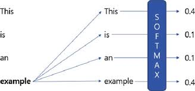
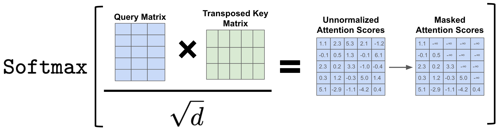
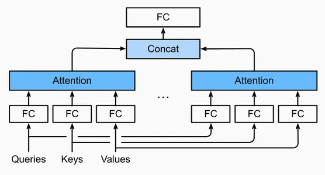
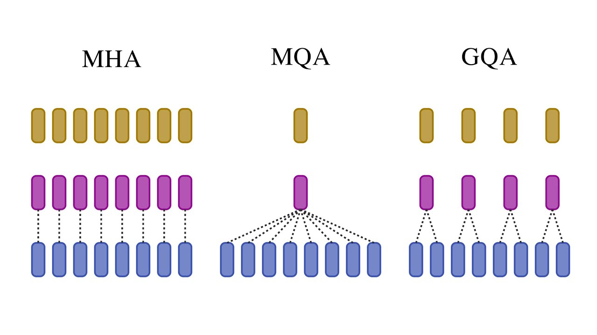

# Day 10 — Types of Attention Mechanisms

> **Attention is the core operation that powers Transformers and modern Large Language Models.**

---

## 1. What Is Attention?

### Definition

**Attention** is a mechanism that allows a model to **dynamically focus on the most relevant parts of an input sequence** when computing representations.

Instead of treating all tokens equally, attention assigns **importance scores (weights)** to tokens based on relevance.

>  *A token decides what to pay attention to.*

---

## 2. Self-Attention

### Definition

**Self-Attention** allows each token in a sequence to attend to **all other tokens in the same sequence**, including itself.

It is the foundation of the Transformer encoder.

---

### Mathematical Formulation

Given an input sequence matrix:

```
X ∈ ℝ^(n × d)
```

We compute:

```
Q = XW_Q
K = XW_K
V = XW_V
```

Scaled Dot-Product Attention:

```
Attention(Q, K, V) = softmax(QKᵀ / √d_k) V
```

---

### Intuition

Each token:

* Creates a **query** (what it is looking for)
* Compares it with **keys** (what others offer)
* Aggregates **values** based on similarity

---

### NLP Example

Sentence:

> "The cat sat on the mat"

The word **"sat"** may attend strongly to **"cat"** (subject) and **"mat"** (location).

---

### Solved Numerical Example (Self-Attention)

Assume 2 tokens with 2-dimensional embeddings:

```
X = [[1, 0],
     [0, 1]]
```

Let:

```
W_Q = W_K = W_V = Identity
```

Step 1 — Compute Q, K, V:

```
Q = K = V = X
```

Step 2 — Compute QKᵀ:

```
QKᵀ = [[1, 0],
        [0, 1]]
```

Step 3 — Scale:

```
√d_k = √2 ≈ 1.414
```

```
Scaled = [[0.71, 0],
          [0, 0.71]]
```

Step 4 — Softmax (row-wise):

```
[[0.67, 0.33],
 [0.33, 0.67]]
```

Step 5 — Multiply by V:

```
Output = Attention × V
```

Each token attends mostly to itself.

---

## 3. Masked Self-Attention

### Definition

**Masked Self-Attention** prevents tokens from attending to **future tokens**.

Used in **Transformer decoders**.


---

### Why Masking Is Needed

During generation, the model must not see future words.

> Prevents cheating during training.

---

### Mathematical Formulation

Apply a mask `M`:

```
Attention(Q,K,V) = softmax((QKᵀ + M) / √d_k) V
```

Where:

* Future positions → `-∞`
* Past positions → `0`

---

### Example Mask Matrix

For 3 tokens:

```
M = [[0, -∞, -∞],
     [0,  0, -∞],
     [0,  0,  0]]
```

---

### Solved Numerical Example (Masked Attention)

Assume attention scores:

```
Scores = [[2, 1, 3]]
```

Apply mask:

```
Masked = [2, 1, -∞]
```

Softmax:

```
[0.73, 0.27, 0]
```

The model **cannot attend to the future token**.

---

## 4. Multi-Head Attention

### Definition

**Multi-Head Attention** runs **multiple attention operations in parallel**, each learning different relationships.


---

### Mathematical Formulation

For head `i`:

```
head_i = Attention(QW_Q^i, KW_K^i, VW_V^i)
```

Concatenation:

```
MultiHead = Concat(head_1, ..., head_h)W_O
```

---

### Why Multiple Heads?

Each head can learn:

* Syntax
* Semantics
* Positional relations

---

### Example

In:

> "She gave him a book"

Different heads focus on:

* Subject–verb relation
* Object ownership
* Pronoun resolution

---

### Solved Numerical Example (2 Heads)

Let output of:

```
head_1 = [1, 0]
head_2 = [0, 1]
```

Concatenation:

```
[1, 0, 0, 1]
```

Apply projection `W_O` to get final output.

---

## 5. Multi-Query Attention (MQA)

### Definition

**Multi-Query Attention** shares **Keys and Values across all heads**, while keeping **separate Queries**.

Used in **large-scale LLMs** for efficiency.

---

### Motivation

Standard MHA is memory expensive.

MQA reduces:

* KV cache size
* Inference latency

---

### Mathematical Formulation

```
Q_i = XW_Q^i
K = XW_K
V = XW_V
```

All heads attend to the same K and V.

---

### Example

GPT-style decoding where:

* Queries differ per head
* Context memory is shared

---

### Solved Numerical Example

Assume:

```
Q₁ ≠ Q₂
K = [1, 1]
V = [2, 2]
```

Both heads attend to **same memory**, reducing computation.

---

## 6. Grouped-Query Attention (GQA)

### Definition

**Grouped-Query Attention** is a hybrid between:

* Multi-Head Attention
* Multi-Query Attention

Queries are grouped to share Keys and Values.

---

### Why GQA?

Balances:

* Model quality (MHA)
* Efficiency (MQA)

Used in **LLaMA, Mistral**.

---

### Mathematical Formulation

If `h` heads and `g` groups:

```
Each group shares K and V
```

---

### Example

8 heads, 2 groups:

* Heads 1–4 share KV
* Heads 5–8 share KV

---

### Solved Numerical Example

Let:

```
Group 1 KV = [1, 0]
Group 2 KV = [0, 1]
```

Heads in same group attend to shared context.

---

## 7. Comparison Summary

| Attention Type | Keys/Values | Queries | Use Case              |
| -------------- | ----------- | ------- | --------------------- |
| Self-Attention | Unique      | Unique  | Encoder               |
| Masked SA      | Unique      | Unique  | Decoder               |
| Multi-Head     | Unique      | Unique  | Standard Transformers |
| Multi-Query    | Shared      | Unique  | Efficient LLMs        |
| Grouped-Query  | Grouped     | Unique  | Balanced LLMs         |


---

## 8. Key Takeaways

* Attention is the **core intelligence unit** of Transformers
* Masking enables autoregressive generation
* Multi-head improves representation power
* MQA and GQA enable **scalable LLM inference**

---

## Acknowledgement

This content is compiled from research papers, lectures, and practical LLM design insights for educational purposes.
