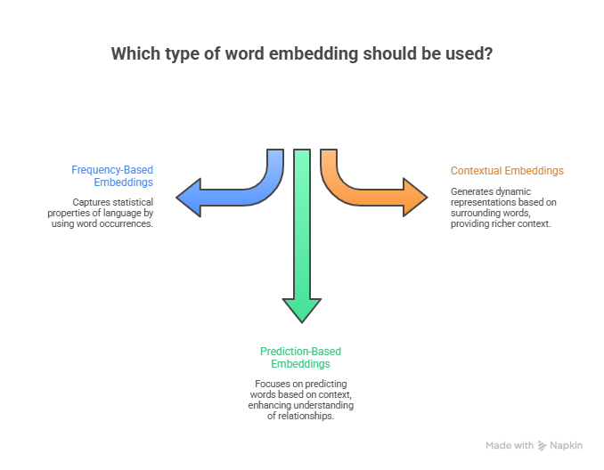
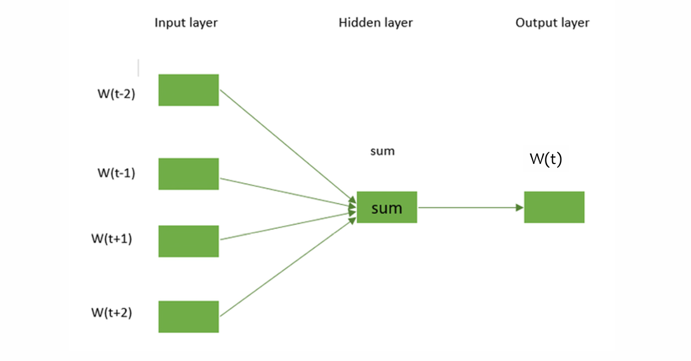

# Day 05 — Word Embeddings

Language models cannot work directly with words.
Before machines can understand meaning, **words must be converted into numbers** but *not just any numbers*.

This is where **word embeddings** come in.

---

## Why Do We Need Word Embeddings?

Humans understand that:

* *cat* and *dog* are similar
* *king* and *queen* are related
* *apple* (fruit) and *Apple* (company) depend on context

For a computer, words are just symbols.

Traditional representations like **one-hot encoding** fail because:

* They are extremely sparse
* They encode **no similarity**
* Every word is equally distant from every other word

 **Key Insight:**
To capture meaning, words must be represented in a **continuous vector space**, where **distance encodes similarity**.

---

## What Are Word Embeddings?

**Word embeddings** are dense vector representations of words where:

* Each word is mapped to a vector (e.g., 100–300 dimensions)
* Words used in similar contexts have similar vectors
* Semantic and syntactic relationships emerge naturally

**Definition:**

> Word embeddings encode meaning by learning from **contextual co-occurrence**, not predefined rules.

---

## Intuition: Personality Embeddings Analogy

Think of a personality test. You might score:

* Introversion ↔ Extroversion
* Logical ↔ Emotional
* Risk-averse ↔ Risk-seeking

Each person becomes a **point in multi-dimensional space**.

> Word embeddings work the same way — but the dimensions are **learned automatically**, not labeled.

---

## Semantic Geometry: The Famous Example

Word embeddings allow **vector arithmetic**:

```
king − man + woman ≈ queen
```

This works because embeddings learn **latent dimensions** such as:

* Gender
* Royalty
* Age
* Profession

 This is not magic — it is geometry in vector space.


---

##  Types of Word Embeddings

Over time, NLP has evolved through **three major embedding paradigms**:

1. **Frequency-based embeddings**
2. **Prediction-based embeddings**
3. **Contextual embeddings**

Each paradigm builds on the previous one, improving **semantic understanding**.



---


##  Frequency-Based Embeddings

Frequency-based methods represent text using **how often words appear**, not how they predict each other.

These were the **first generation of text representations**.

---

## Bag of Words (BoW)

**Bag of Words** represents text as a vector of word counts.

### How It Works

1. Build a vocabulary from the corpus
2. Count occurrences of each word in a document
3. Ignore word order and grammar

### Example

Documents:

* *“I love NLP”*
* *“I love AI”*

Vocabulary:

```
[I, love, NLP, AI]
```

Vectors:

```
Doc1 → [1, 1, 1, 0]
Doc2 → [1, 1, 0, 1]
```

### Limitations of BoW

* No word order
* No semantics
* Very sparse
* Vocabulary grows rapidly

 **Key Insight:**
> BoW treats *“dog bites man”* and *“man bites dog”* as identical.

---

## TF-IDF (Term Frequency – Inverse Document Frequency)

TF-IDF improves BoW by **reducing the importance of common words** and **highlighting informative ones**.

---

### Term Frequency (TF)

Measures how often a word appears in a document.

```
TF(word) = (Number of times word appears in document)
```

> Common words get high TF — but that alone is misleading.

---

### Inverse Document Frequency (IDF)

Downweights words that appear in **many documents**.

```
IDF(word) = log(Total Documents / Documents containing word)
```

* Rare words → high IDF
* Common words → low IDF

---

### TF-IDF Formula

```
TF-IDF(word) = TF(word) × IDF(word)
```

 **Intuition:**

> A word is important if it is **frequent in one document** but **rare across the corpus**.

---

### Example

Corpus:

* Doc1: *“NLP is amazing”*

* Doc2: *“NLP is powerful”*

* Doc3: *“AI is powerful”*

* “is” → low TF-IDF (appears everywhere)

* “amazing” → high TF-IDF (rare and informative)

---

### Advantages of TF-IDF

* Simple and effective
* Strong baseline for search and classification
* Still widely used in industry

### Limitations

* No semantics
* No word similarity
* No context awareness
* High dimensional and sparse

> TF-IDF **represents importance**, not meaning.

---

## 2 Prediction-Based Embeddings

Prediction-based models learn embeddings by **predicting words from context**.

This is where **semantics truly emerge**.

## What Is Word2Vec?

**Word2Vec** is a technique for learning word embeddings using a **shallow neural network**.

Key ideas:

* Learn from raw text
* No labeled data required
* Context defines meaning

 **Important:**
Word2Vec does **not** store explicit features like *gender* or *royalty*.
Those relationships **emerge from data**.

---

## Word2Vec Architecture (High Level)

Word2Vec is a **2-layer neural network**:

1. **Input layer**

   * Words represented as one-hot vectors
2. **Hidden layer**

   * Dense embedding layer (this is what we care about)
3. **Output layer**

   * Predicts words or context

At the end of training:
 **The hidden layer weights become the word embeddings**


---

## Two Word2Vec Training Approaches

Word2Vec can be trained in **two ways**:

* **CBOW (Continuous Bag of Words)**
* **Skip-Gram**

Both learn embeddings — they just ask **opposite questions**.

---

## CBOW — Predict the Target Word

**CBOW predicts a word using its surrounding context.**

### Example Sentence

> *“The cake was chocolate flavoured”*

CBOW task:

```
Context → Target
(The, was, chocolate, flavoured) → cake
```

### How CBOW Works

1. Convert context words to one-hot vectors
2. Map them to embeddings
3. Average embeddings
4. Predict the target word using softmax

 **Properties**

* Faster to train
* Works well with frequent words
* Smooths information across context


---

## Skip-Gram — Predict the Context

**Skip-Gram predicts surrounding words given a center word.**

Using the same sentence:

```
Input → Outputs
cake → The, was, chocolate, flavoured
```

### Why Skip-Gram Is Powerful

* Each (center, context) pair is a training example
* Better at learning rare words
* Works well with smaller datasets

 **Trade-off:** Slower, but more expressive


---

## Window Size: Controlling Context

The **window size** determines how many neighboring words are considered.

Example (window = 2):

```
The quick brown fox jumps over the lazy dog
                ↑
Context: quick, brown, jumps, over
```

* Small window → syntactic relationships
* Large window → semantic relationships

---

## Training Skip-Gram: The Core Idea

For each training step:

1. Take one **positive pair**
   (word, true neighbor)
2. Add several **negative samples**
   (word, random non-neighbors)
3. Optimize embeddings so:

   * Positive pairs get higher similarity
   * Negative pairs get lower similarity

 This converts softmax classification into **logistic regression**, making training efficient.

---

## Negative Sampling (Why It Matters)

Without negative samples:

* Model could predict “1” for everything
* Learn nothing useful

Negative sampling forces the model to **discriminate**:

> “Which words *do not* belong in this context?”


---

## What Happens After Training?

After training completes:

* Discard the output/context matrix
* Keep the embedding matrix
* Each row = vector for one word

These embeddings can now be reused for:

* Sentiment analysis
* Text classification
* Question answering
* Machine translation
* As inputs to LLMs

---

## Limitations of Word2Vec

Despite its impact, Word2Vec has limits:

* One embedding per word (no context awareness)
* Cannot handle polysemy well
  (*bank* = river vs finance)
* Static embeddings
* Cannot model long-range context

 These limitations led to **contextual embeddings** (ELMo, BERT, GPT).

---
## Why Word2Vec Still Matters (Even in LLM Era)

Word2Vec:

* Introduced distributed semantic representations
* Proved meaning can emerge from context
* Inspired all modern embedding techniques

 **LLMs are not replacements — they are evolutions.**

---

## GloVe — Global Vectors for Word Representation (Stanford, 2014)

**GloVe** combines ideas from:

* Frequency-based methods (global co-occurrence)
* Prediction-based methods (learning embeddings)

---

### Core Idea of GloVe

> Meaning comes from **global word co-occurrence statistics**.

Instead of predicting words sequentially:

* Build a **co-occurrence matrix**
* Learn embeddings so dot products approximate co-occurrence ratios

# Example:

* *ice* co-occurs more with *cold* than *steam*
* *steam* co-occurs more with *hot*

---

### Why GloVe Was Important

* Captures **global corpus statistics**
* Produces more stable embeddings
* Faster convergence than Word2Vec

 GloVe paper (Stanford):
[https://nlp.stanford.edu/projects/glove/](https://nlp.stanford.edu/projects/glove/)

---

### Limitations of Word2Vec & GloVe

Both produce **static embeddings**:

* One vector per word
* Same embedding in every context

> *“bank”* is always the same vector — regardless of meaning.

This leads to the next evolution.

---

##  Contextual Embeddings

Contextual embeddings generate **different vectors for the same word**, depending on context.

This is a **major breakthrough** in NLP.

---

## BERT — Contextual Embeddings with Transformers 

**BERT (Bidirectional Encoder Representations from Transformers)** produces embeddings that depend on **surrounding words on both sides**.

### Example

```
“I sat on the river bank”
“I deposited money in the bank”
```

The word *bank* gets **two different embeddings**.

---

### Key Ideas Behind BERT

* Bidirectional context
* Transformer architecture
* Pretrained on massive corpora
* Fine-tuned for downstream tasks

 BERT embeddings are **contextual, deep, and task-aware**.


---

### Why We Don’t Go Deep into BERT Here

* BERT deserves **multiple dedicated days**
* Requires understanding:

  * Attention
  * Transformers
  * Masked language modeling

 This will come later in your LLM series.

---


##  Key Takeaway 

* Frequency-based methods capture **importance**
* Prediction-based methods capture **meaning**
* Contextual embeddings capture **dynamic meaning**
* This evolution leads directly to **Transformers and LLMs**


##  Acknowledgement

Various contents in this presentation have been taken from different books, lecture notes, and web resources.
These materials solely belong to their respective owners and are used here only for educational clarification.
**No copyright infringement is intended.**


